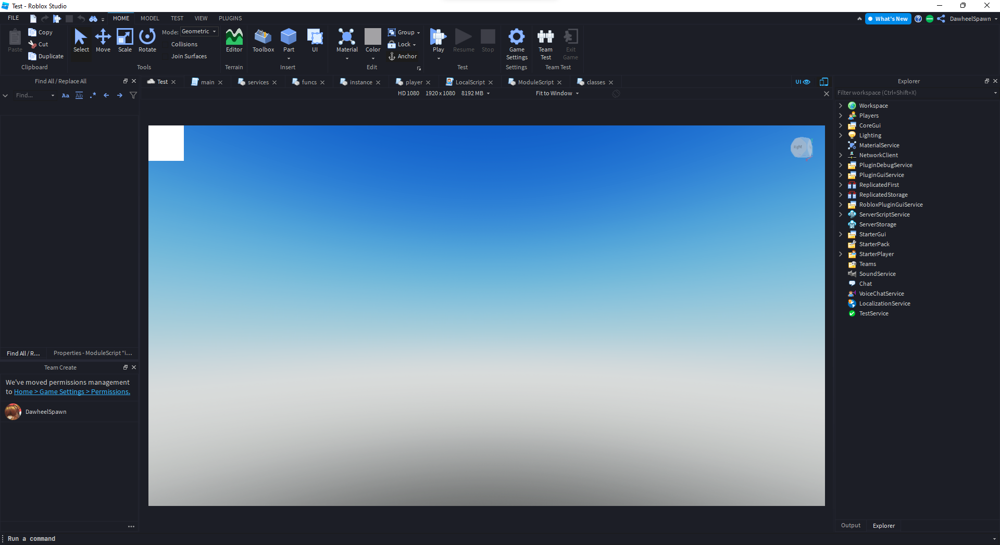

# studio theme manager
<b>This is for educational purposes only. Use at your own risk!</b>
<b>Only works on windows.</b>

## table of contents

- [description](#description)
- [creating themes](#creating-themes)
- [example theme](#example-theme)
- [how it works](#how-it-works)
- [installation](#installation)
- [building from source](#building-from-source)

## description

A theme manager for Roblox Studio that allows you to edit and manage your theme. By default studio only comes with the option to change the theme of the editor. 

## creating themes

If you make any themes you want included by default in Studio Theme Manager make a pull request and I will merge

## example theme



## how it works
The two themes studio has built-in are compiled into the executable as Qt5 resources. The easiest way to overwrite the default theme with a custom one is by injecting a dll into studio and hooking the theme loader. Studio Theme Manager works by hooking QJsonDocument::fromJson from the Qt5 framework and returning a custom theme file to replace the real one.

## installation 
1. download the newest release.
2. run studio-theme-manager.exe <b>as admin</b>.
3. select a theme.
4. launch studio.

## building from source
1. open the .sln file in /cpp
2. build theme-hook and studio-theme-manager
3. drag the exe and the dll from /cpp/Release/x64 into /electron/bin
4. open the folder in cmd and run 
``` npm run build```
5. copy the themes folder into the output folder of the electron build
 
